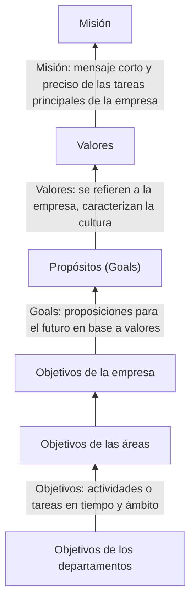
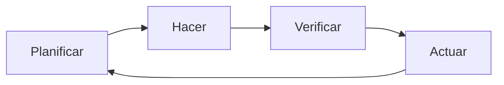
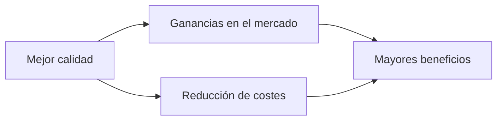

# Tema 2: Gestión de la calidad

## 1. Concepto y principios

### 1.1 Gestión de la calidad

Según **UNE-EN ISO 9000:2015** :

>Gestión con respecto a la calidad en la organización, que puede incluir el establecimiento de la política de calidad y sus objetivos mediante la planificación, aseguramiento, control y mejora.

### 1.2 Principios

- Es clave para lograr la **competividad**
- Determinada por el **cliente**
- Incluye a **toda la organización**
- La calidad de los productos y servicios es **consecuencia de los procesos**
- Es lograda por personas y para personas
- Es, **principalmente, responsabilidad gerencial**
- Requiere una **nueva cultura organizativa**

### 1.3 Política de calidad

Intenciones globales y orientación global de la organización relativa a la calidad tal como son expresadas por la alta dirección.

## 2. El ciclo de Deming

 Lleva a un proceso de __mejora contínua__ y, consecuentemente, a la __excelencia__.

### 2.1 Planificación de la calidad

 >Parte de la gestión de la calidad orientada a establecer los objetivos de la calidad y a la especificación de los procesos necesarios y sus recursos relacionados para cumplir los objetivos.

Incluye la **elaboración de planes** y la **determinación de los objetivos** y requisitos para la calidad. Es __esencial__ para lograr la mejora.

### 2.2 Aseguramiento de la calidad

> Parte de la gestión orientada a proporcionar confianza en que se cumplirán los requisitos de calidad.

**No** pretende **detectar errores**. Busca hacer las cosas **bien a la primera**.

El aseguramiento de la calidad no garantiza la satisfacción del cliente, ya que los requisitos propuestos podrían ser incorrectos.

### 2.3 Control de la calidad

> Parte de la gestión orientada al cumplimiento de los requisitos de calidad

**Comprueba** que lo realizado se ajusta a lo planificado.

###### Tres componentes:

1. Estándar a alcanzar.
2. Medidas para evaluar la ejecución.
3. Proceso de comparación de resultados.

### 2.4 Mejora de la calidad

> Parte de la gestión orientada a aumentar la capacidad de cumplir con los requisitos de calidad.

- __Conformidad__: cumplimiento con un requisito.
- __Defecto__: no conformidad relativa a un uso especificado.
- __Desempeño__: resultado medible.
- __Eficacia__: grado en que se logran los resultados planificados.
- __Eficiencia__: relación entre resultados y recursos utilizados.
- __Trazabilidad__: capacidad para seguir el histórico, aplicación o la localización de un objeto.

## 3. Gestión de los recursos humanos

Suelen ser el **área más ineficientemente gestionada** de las organizaciones, ya que el capital humano es impredecible (al contrario que los robots 🤖).

Es necesario **involucrar a los empleados** en todos los pasos del proceso de producción.

###### Técnicas a aplicar:

- Reclutamiento y selección adecuados.
- Formación y entrenamiento.
- Permitir al empleado tomar decisiones: __Empowerment__.
- Formar __Grupos de mejora__.
- Seguimiento contínuo 🕵🏻‍♂️.

###### Grupos de mejora

Grupo de entre 6 a 12 **personas del mismo área de trabajo**, que se reunen regularmente para **solucionar problemas**. Existe un **guía (no espiritual)** que ayuda en la organización de reuniones.

###### Calidad total: enfoque a las __personas__ 

Comprende **toda la organización**, desde proveedores a clientes, y **acentúa el compromiso** de la dirección para que toda la compañia sea excelentísima (en relación a los aspectos importantes para los clientes).
Requiere del compromiso de todo el personal.

## 4. Estándares para la gestión

### 4.1 Normas ISO

Abarcan todos los sectores, a excepción del sector eléctrico y del electrónico.

El comité técnico __ISO/TC 176 "Gestión y Aseguramiento de la Calidad"__ trata los temas relacionados con la calidad, desarrollando la normativa __ISO 9000__.

### 4.2 Normas ISO 9000

Revisión de las normas anteriores producida en el año 2000, y que persigue __adaptarse a los principios de la Calidad Total__.

#### 7 Principios:

- Enfoque al __cliente__.
- __Liderazgo__.
- __Compromiso__ con las personas.
- Enfoque a __procesos__.
- __Mejora__.
- Toma de decisiones basada en __evidencias__.
- Gestión de las __relaciones__.

###### UNE-EN ISO 9000:2015
__Sistemas de gestión de la calidad. Fundamentos y vocabulario__.

###### UNE-EN ISO 9001:2015
__Sistemas de gestión de la calidad. Requisitos__.

###### UNE-EN ISO 9004:2018
__Gestión de la calidad. Calidad de una organización. Orientación para lograr el éxito sostenido__.

###### ISO 19011:2018 (No forma parte del estándar ISO 9000)
__Directrices para la auditoría de los sistemas de gestión__.

### 4.3 Modelos de calidad total

Los 3 modelos principales han sido promovidos a través de la creación de __premios__ a la calidad.

1. Modelo __Deming__ 🇯🇵.
2. Modelo __Malcom Baldrige__ 🇺🇸.
3. Modelo __EFQM__ 🇪🇺.

#### Marca AENOR

> Pone de manifiesto que una organización, producto, proceso, o servicio, cumple con los requisitos definidos en las normas que le aplican y ha sido reconocido por la entidad independiente __AENOR__, que otorga su símbolo.

Es una marca reconocida y valorada en toda la sociedad, y puede suponer una importante aportación de valor ante los retos que plantea la recuperación europea, así como facilitar la apertura de nuevos mercados.

#### Norma ISO/TS 16949

- Es el __estándar internacional para la industria del automóvil__.
- **Desarrollado por los principales fabricantes** y basado en la norma ISO 9001 y normas nacionales.
- **Unifica y sustituye** normas americanas, alemanas, francesas e italianas existentes.
- __Identifica requisitos a satisfacer__ para cualquier producto del sector.

#### Diferencias entre acreditación y certificación ISO 9001

> Una organización __certificada__ ha demostrado que su sistema de gestión de la calidad cumple los requisitos, mientras que una __acreditada__ ha demostrado su competencia para __evaluar__ el cumplimiento de los requisitos (laboratorios, entidades de certificación, etc).

- La __certificación__ es una actividad __comercial__, dirigida a cualquier organización. Es una actividad __no regulada__ que puede ser ofrecida por cualquier empresa.

- La __acreditación__ es una actividad __especializada__, dirigida exclusivamente a organizaciones que realizan actividades de __evaluación de la conformidad__, es una actividad __regulada__ y sólo puede ser desempeñada por el __ENAC en__ 🇪🇸.