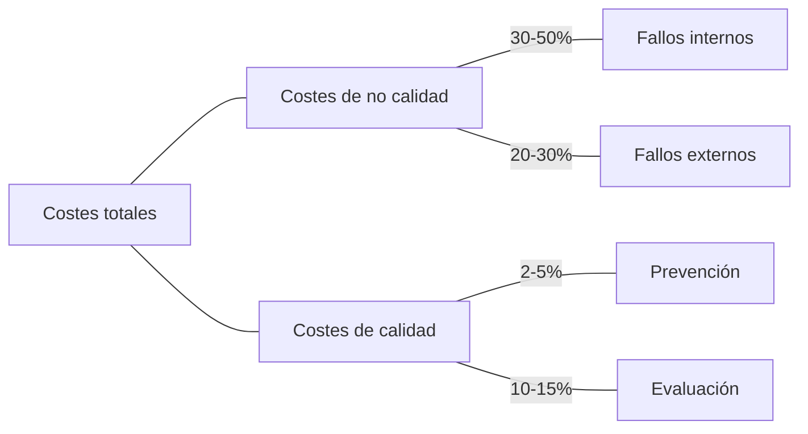

## 1. Calidad y gestión económica de la empresa

> __CALIDAD = COMPETITIVIDAD__.

- La __calidad__ es el factor determinante en la gestión de la empresa.
- Disminuir costes puede repercutir en la calidad.
- Se consigue **competitividad** mediante la calidad.

###### Contabilidad de costes:

Permite **identificar el coste** de producir un producto o servicio, el coste de las etapas de elaboración, y el coste de los departamentos de la empresa.

#### Ideas sobre los costes de la calidad

> Aquellos costes de explotar un sistema de aseguramiento de la calidad, teniendo en cuenta costes de rechazo y garantía.

- Hacer las cosas **bien a la primera elimina costes** de corrección de errores e **insatisfacción** del cliente.

###### Ventajas:

- Mayor __satisfacción__ del cliente.
- __Diferenciación__ de productos y servicios.
- Mayor __cuota de mercado__.
- Aumento del __beneficio__ y reducción del __precio__.
- Mejoras en la __gestión__, __planificación de actividades__ y __productividad__.

![[Calidad/attachments/Pasted image 20220315191538.png]]

## 2. Clasificación de los costes de la calidad

### 2.1 Costes de no calidad

Ocasionados por la falta de calidad. Incluyen costes de __oportunidad__ o costes __intangibles__.

- Internos: ocasionados por fallos __detectados antes de la entrega__ al cliente. Controlables por la contabilidad.
- Externos: fallos __detectados tras la entrega__. No controlables por contabilidad. Conllevan una __mala imagen de la empresa y pérdida de clientes__.

### 2.2 Costes de calidad

> Aquellos costes que se originan a consecuencia de las actividades de prevención y evaluación que la empresa debe de acometer en un plan de calidad.

Los que la empresa incurre para **controlar** que se cumplen las especificaciones de __calidad__.

- Prevención: costes para __reducir o evitar fallos__. (Evaluación de proveedores, formación de personal, etc).
- Evaluación: costes para garantizar que los productos __no conformes__ sean __identificados antes de la entrega__. (Inspecciones, ensayos, etc).

###### Costes ocultos de la calidad:

Aquellos costes por fallos que __no se pueden reflejar en la contabilidad__ o se hace por __menos importe del real__. (Mano de obra extra, reparación, aumento del riesgo de averías, absentismo laboral, etc).

Su detección requiere de intuición.

![[Calidad/attachments/Pasted image 20220315193752.png]]

## 3. Función de pérdida de calidad de Taguchi

> Evitar la pérdida que un producto causa a la sociedad después de embarcarlo 🚢, excepto las pérdidas causadas por funciones intrínsecas.

Las __pérdidas a la sociedad__ incluyen: __insatisfacción__, costes por no cumplir las características (__implicaciones__), y costes por __efectos peligrosos secundarios__ (medio ambiente, etc).

El modelo de Taguchi __relaciona directamente la economía con la variabilidad de la producción__; suponiendo toda la desviación de lo ideal un gasto (costes de variación).
$$L(x) = K(x - T)^2$$
Siendo:

$L(x) = función\; de\; pérdida$; $K = cte\; de\; proporcionalidad$; $x = valor\; de\; calidad\; medida$ $y$ $T = valor\; deseado$.

###### Ejemplo:

> Un servicio de venta telefónica (Jazztel) tiene estipulado una duración nominal de llamada de 5 minutos, con 1 minuto de tolerancia por llamada. Si el teleoperador supera el límite, la empresa podría incurrir en pérdidas estimadas de 70€ (posible venta de un Samsung Galaxy S5 a otro cliente). Determinar la función de pérdida de calidad de Tamagotchi.
$$L(x) = K(x - T)^2$$
$$70 = K(6 - 5)^2$$
$$K = \frac{70}{(6-5)^{2}}= 70 \frac{€}{min}$$
$$\boldsymbol{L(x) = 70(x - 5)^2}$$

## 4. Sistema de gestión de costes de la calidad

La __gestión de los costes de la calidad__ en una organización comporta los siguientes elementos:

1. Recogida de datos.
2. Análisis de los datos.
3. Redacción de informes.
4. Toma de decisiones.

Ayuda tener implantado un __sistema__ de gestión de los costes, que se implanta siguiendo múltiples etapas (formación, desarrollo, identificación de elementos, etc).

###### Ratios empleados:
$$\frac{C_F}{C_{T}}$$
$$\frac{C_P}{C_{T}}$$
$$\frac{C_C}{E}$$
$$\frac{C_C}{V}$$
Siendo:

${C_{F}=Costes\;por\;fallos}$; $C_{P}=Costes\;de\;prevención$; $C_{C} = Costes\;de\;calidad$; $C_{E}=Costes\;de\;evaluación$; $C_{T}=Costes\;totales\;de\;calidad\;(C_{F}+C_{P}+C_{E})$;$E = número\;de\;empleados$ $y$ $V = Volumen\;de\;ventas\;(um)$

### 4.1 Análisis del valor

> Metodología creada por __Lawrence Miles__ para _General Electric_. Adoptada y adaptada por empresas niponas 🇯🇵, y se volvió objeto de interés de las occidentales.

Es un __método para diseñar__ un producto o servicio de forma que asegure, con __mínimo coste__, las funciones que el __cliente desea__ y está dispuesto a pagar, y __no más__. Busca mejorar la **calidad**, la **productividad**, y la **rentabilidad**.

Se puede aplicar a productos, servicios, innovaciones tecnológicas, procedimientos técnicos, o procesos de gestión.